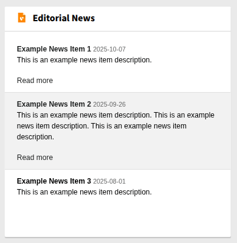
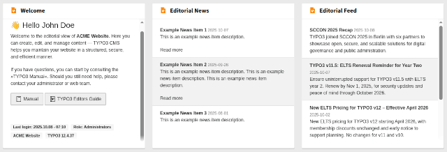

# TYPO3 Dashboard News `xima_typo3_dashboard_news`

[](https://packagist.org/packages/xima/xima-typo3-dashboard-news)
[](https://extensions.typo3.org/extension/xima_typo3_dashboard_news)
[](https://extensions.typo3.org/extension/xima_typo3_dashboard_news)

Display important messages and announcements in the TYPO3 dashboard to keep editorial teams in the loop



## Features

The package allows editors to be informed easily and directly via the TYPO3 dashboard.
It is deliberately limited to creating and displaying short news,
or alternatively an RSS feed, to ensure simple and straightforward use and maintenance.

Available widgets:

- Editorial News: Displays a short list of important messages and announcements for the editorial team
  - Adding news is restricted to admins by default
  - Integrators may allow editors to create and manage news items to show for everybody
- Editorial Feed: Displays a short list of important news feed items for the editorial team
  - Integrators may set up an external RSS feed to show news from a project blog or release notes etc
- Welcome: Displays a welcome message for editors with useful links and information
  - Integrators may add a link to a custom manual



✨ These news records are not enough for your needs? Check out our
[internal news extension](https://github.com/xima-media/xima-typo3-internal-news),
which provides a full-featured backend news system including categories, media files,
recurring dates, a dedicated toolbar module, and a breaking news feature
(display selected news as modal when a user logs in).

✨ You want to give your editors some more insights to the content quality
of their pages? Check out our
[content audit extension](https://github.com/xima-media/xima-typo3-content-audit),
which shows stale content, missing metadata and more.

## Requirements

- PHP
- TYPO3

## Installation

``` bash
composer require xima/xima-typo3-dashboard-news
```

⚠️ When you want to configure the widgets you need to
require the package in your sitepackage,
to keep the correct order of service definitions.

## Source

https://github.com/xima-media/xima-typo3-dashboard-news

## Usage

- Configure the widgets as needed (see below)
- Add dashboard news items to the root page
  (or any other page, just change the configuration accordingly)
- When editors should be able to create news items,
  make sure to give them access rights to the storage folder
  and the news record table, and change the widget configuration
- Allow the widgets in the backend group settings
- Let editors add the widget to their dashboard

### Configuration

You may configure the widgets by adjusting the available parameters.
Copy and paste the `parameters` section from the
[Services.yaml](./Configuration/Services.yaml) file into your own
and adjust the values as needed.

Example to allow selected editors adding dashboard news records
in storage folder `1337` as well and reduce the maximum characters shown:

_EXT:acme_sitepackage/Configuration/Services.yaml_
```yaml
parameters:
    xima_typo3_dashboard_news.widgets.news.options:
        allowedPageUids: [0,1337]
        maxCharacters: 200
```

Example to fetch news from a custom project feed:

_EXT:acme_sitepackage/Configuration/Services.yaml_
```yaml
parameters:
    xima_typo3_dashboard_news.widgets.feed.options:
        feedUrl: 'https://example.com/agency/release-notes.xml'
```

The package comes with a preset including all widgets. To assign the preset to
all new users, add this line to your TSconfig:

```
options.dashboard.dashboardPresetsForNewUsers = tx_ximatypo3dashboardnews_dashboard
```

Widgets are always filtered by permissions of each user. Only widgets that are permitted
for the user appear on the board.

💡 Hint: You may create your own a dashboard preset including some default widgets you want
to show your editors:
[TYPO3 Docs - Dashboard Presets](https://docs.typo3.org/permalink/typo3-cms-dashboard:dashboard-presets)

## License

GNU General Public License version 2 or later

The GNU General Public License can be found at http://www.gnu.org/copyleft/gpl.html.

## Author

Dan Kleine ([@pixelbrackets](https://github.com/pixelbrackets)) for [XIMA](https://www.webit.de/)

## Changelog

[CHANGELOG.md](CHANGELOG.md)
